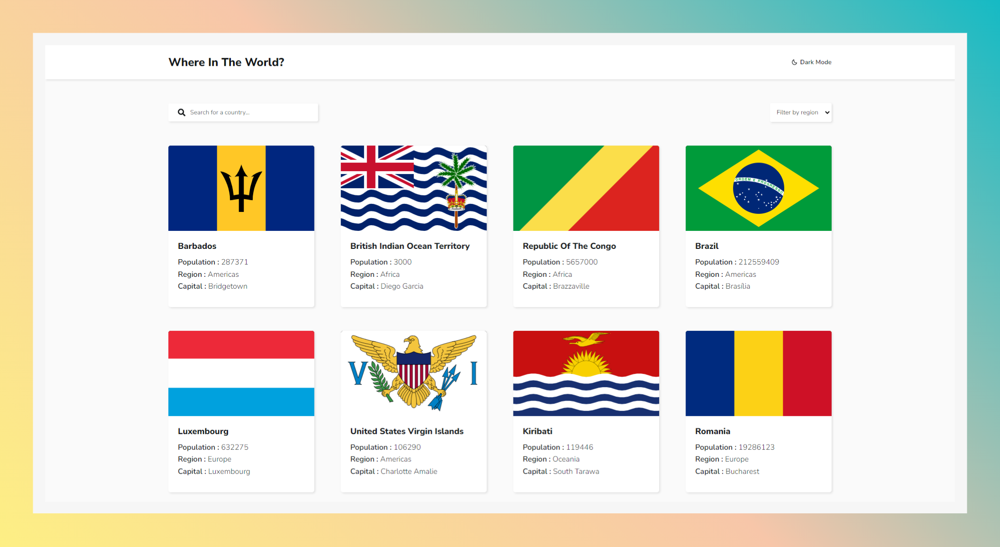
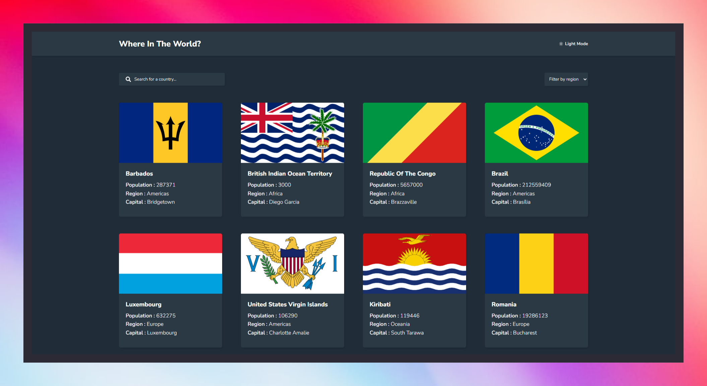
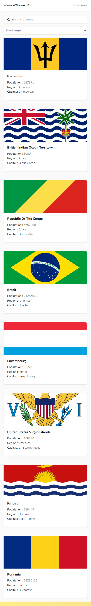
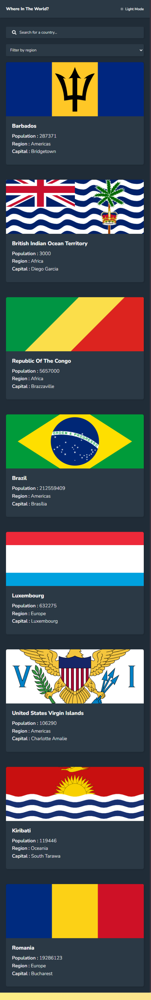
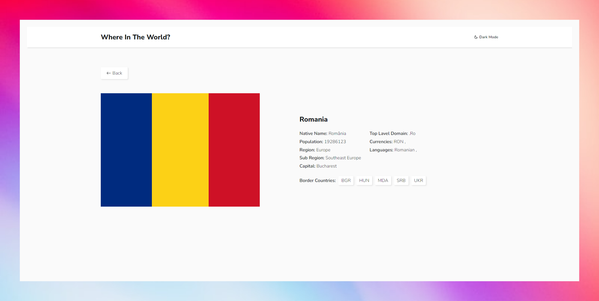
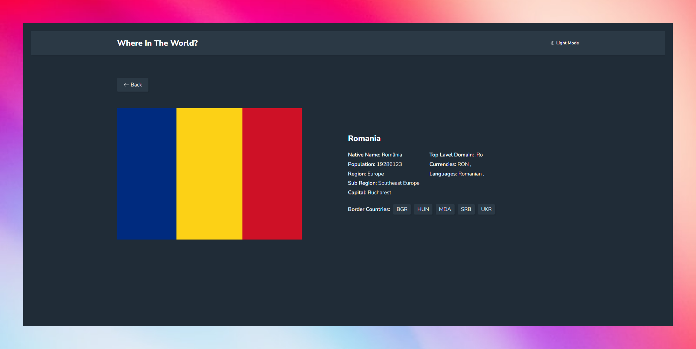
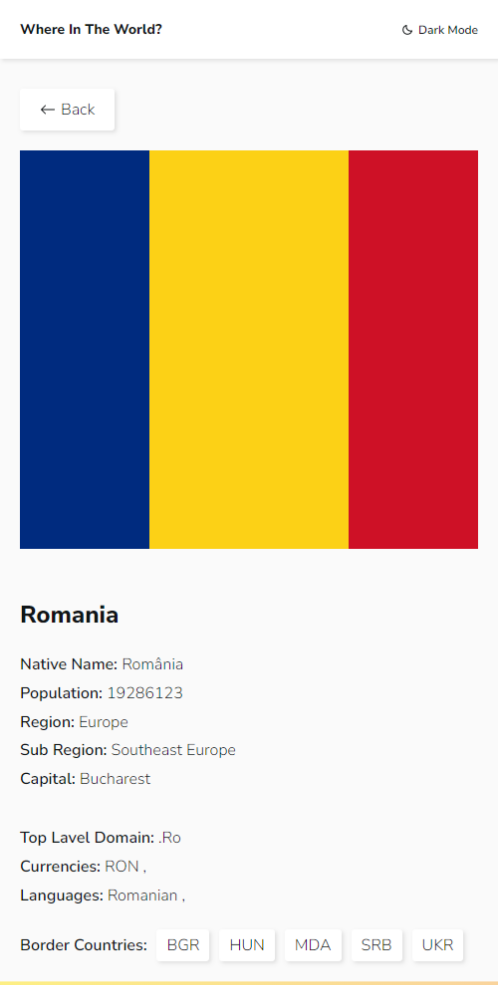
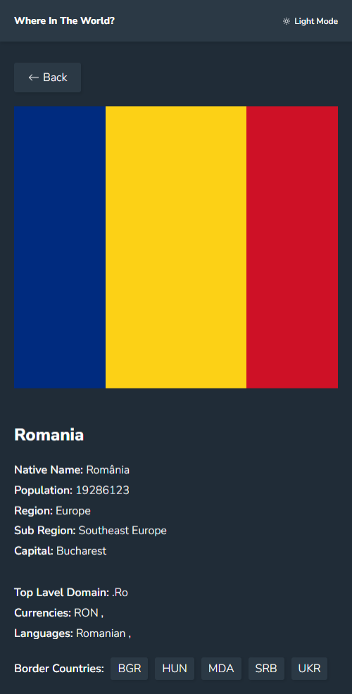

# Frontend Mentor - REST Countries API with color theme switcher solution

This is a solution to the [REST Countries API with color theme switcher challenge on Frontend Mentor](https://www.frontendmentor.io/challenges/rest-countries-api-with-color-theme-switcher-5cacc469fec04111f7b848ca). Frontend Mentor challenges help you improve your coding skills by building realistic projects. 

## Table of contents

- [Overview](#overview)
  - [The challenge](#the-challenge)
  - [Screenshot](#screenshot)
  - [Links](#links)
- [My process](#my-process)
  - [Built with](#built-with)
  - [What I learned](#what-i-learned)
  - [Continued development](#continued-development)
  - [Useful resources](#useful-resources)
- [Author](#author)

## Overview

### The challenge

Users should be able to:

- See all countries from the API on the homepage
- Search for a country using an `input` field
- Filter countries by region
- Click on a country to see more detailed information on a separate page
- Click through to the border countries on the detail page
- Toggle the color scheme between light and dark mode 

### Screenshot

### Links

- Solution URL: [github link](https://github.com/MiR-stack/rest_countries.git)
- Live Site URL: [Add live site URL here](https://your-live-site-url.com)

## My process

### Built with

- Semantic HTML5 markup
- CSS custom properties
- Flexbox
- CSS Grid
- Mobile-first workflow
- [React](https://reactjs.org/) - JS library
- [Styled Components](https://styled-components.com/) - For styles

### What I learned
in this project i learn how to handle async task. It was not as easy as I thought. i spend two days for these project. in this project i lean most about styled componet like how to define Theme and acces them. why define default attributes in styled component. and use of as attributes.

### Continued development

doing these project was optional . acctually i am learning requirement analysis, requirement breakdown, funtional requirement, component tree , data workflow , basic algorithms ,basic sudu code ,flow chart and finally coading. i will do some optional project for cheking my coading power.

### Useful resources

- [countires rest api](https://restcountries.com/) - i found all country data in this api. but i found some problem in this api. e.g i can't search two items like name and region together , pagination . if you found this problems solution please remind me.

## Author

- Website - [Habibur Rahman](https://github.com/MiR-stack)
- Frontend Mentor - [@MiR-stack](https://www.frontendmentor.io/profile/MiR-stack)

